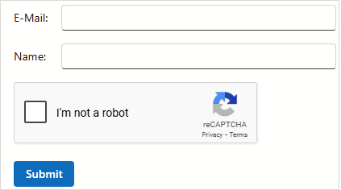

<!-- default badges list -->

<!-- default badges end -->
# DevExpress Blazor Data Editors – Using Google reCAPTCHA

This example adds Google reCAPTCHA to a DevExpress Blazor Form Layout. The Form Layout contains DevExpress Blazor Data Editors, but a DevExpress-specific implementation is not required. Integration steps are the same as any data entry form using any combination of data editor controls.

Refer to the following page for additional information when integrating reCAPTCHA: [reCAPTCHA - Developer's Guide](https://developers.google.com/recaptcha/intro).

## Implementation Details

1. Register your website and obtain site and secret keys from [Google reCAPTCHA](https://www.google.com/recaptcha/admin/create) service.
2. Create a reusable [ReCaptchaComponent](./CS/ReCaptcha/Components/ReCaptchaComponent.razor) that loads Google reCAPTCHA APIs and renders the widget using JavaScript interop.
3. Within the [ReCaptchaComponent](./CS/ReCaptcha/Components/ReCaptchaComponent.razor) implementation, use Google reCAPTCHA APIs to handle success and expiration callbacks. Verify the captcha response using the Google verification service.
4. Add a [ReCaptchaComponent](./CS/ReCaptcha/Components/ReCaptchaComponent.razor) to a Form Layout component. Bind site and secret keys to the component.
5. Handle success and expiration events to modify a flag variable (track captcha status).

Note: This solution obtains keys from the following environment variables: `RECAPTCHA_SITE_KEY` and `RECAPTCHA_SECRET_KEY`. If these variables are not set, the application throws an exception (to indicate missing configuration). You can adapt our implementation and retrieve keys from other sources, such as _appsettings.json_ or a configuration file.

## Files to Review

- [ReCaptchaComponent.razor](./CS/ReCaptcha/Components/ReCaptchaComponent.razor)
- [Index.razor](./CS/ReCaptcha/Components/Pages/Index.razor)

## Documentation

- [reCAPTCHA Documentation](https://developers.google.com/recaptcha/intro)

<!-- feedback -->
## Does this example address your development requirements/objectives?

 

(you will be redirected to DevExpress.com to submit your response)
<!-- feedback end -->

