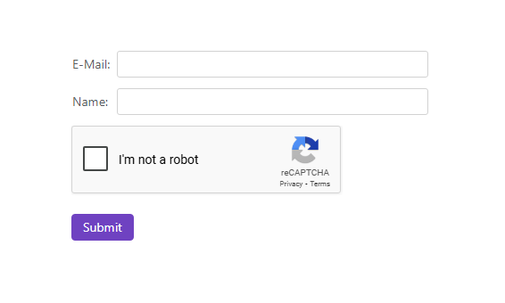

<!-- default badges list -->

<!-- default badges end -->
# DevExpress Blazor - How to add the Google reCAPTCHA tool to a project and use it with DevExpress Editors

This example demonstrates how to implement Google reCAPTCHA with the Blazor DevExpress components.

## Implementation Details

1. Register your website with the [Google reCAPTCHA](https://www.google.com/recaptcha/admin/create) service to obtain a site key and secret key.
2. Create a reusable [ReCaptchaComponent](./CS/ReCaptcha/Components/ReCaptchaComponent.razor) that loads the Google reCAPTCHA API and renders the captcha widget using JavaScript interop.
3. Handle the success and expiration callbacks in the [ReCaptchaComponent](./CS/ReCaptcha/Components/ReCaptchaComponent.razor) to verify the captcha response with Google’s verification service.
4. Insert the captcha widget into your form layout and pass the site key and secret key as parameters.
5. Bind the component’s success and expiration events to local flags to track the captcha status.

Note: The solution reads the site key and secret key from environment variables: `RECAPTCHA_SITE_KEY` and `RECAPTCHA_SECRET_KEY`. If these variables are not set, the application throws an exception to clearly indicate the missing configuration.
You can adapt the implementation to retrieve the keys from other sources, such as appsettings.json or directly from the configuration file, based on your project requirements.

## Files to Review

- [ReCaptchaComponent.razor](./CS/ReCaptcha/Components/ReCaptchaComponent.razor)
- [Index.razor](./CS/ReCaptcha/Components/Pages/Index.razor)

## Documentation

- [reCAPTCHA Documentation](https://developers.google.com/recaptcha/intro)

## Does this example address your development requirements/objectives?

 

(you will be redirected to DevExpress.com to submit your response)
<!-- feedback end -->
<!-- feedback -->
## Does this example address your development requirements/objectives?

 

(you will be redirected to DevExpress.com to submit your response)
<!-- feedback end -->
